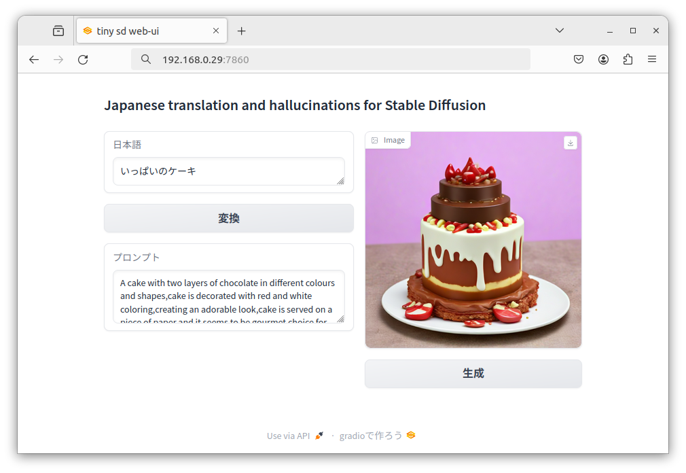

# japanese-translate-tiny-sd-webui

日本語翻訳を試みて、おまけで単語羅列します（それらしいプロンプトを期待）。

Attempts to translate Japanese input and continues with sloppy words as an extra.

# Introduction
I have developed an application that utilizes a decoder model to image generation prompts for StableDiffusion from any Japanese text string. The application translates a short Japanese text string into English, as shown in the figure below, and outputs a generation prompt that is not only natural but also suitable for continuous use in StableDiffusion's image generation.

This application learns the output of English translation strings and continuous strings from Japanese input through fine-tuning of GPT-2 `llm-jp`. The training data consists of `MS COCO` caption annotation data, with `StairCaption` serving as the translation information input and original caption data as the corresponding output. Additionally, the output data includes caption outputs obtained by inputting MS COCO data images into the lightweight VLLM model `uform-gen`.


# Table of contents
 - [Requirements](#requirements)
 - [Files](#files)
 - [Setup](#setup)
 - [Dataset Building](#dataset-building)
 - [Training](#training)
 - [Convert Model](#convert-model)
 - [Running Web application](#running-web-application)
 - [References](#references)

# Requirements
 - Hardware
  	+ [Jetson AGX Orin Developer Kit](https://www.nvidia.com/en-us/autonomous-machines/embedded-systems/jetson-orin/)

 - Software
  	+ [JetPack 6.0 Developer Preview](https://developer.nvidia.com/embedded/jetpack-sdk-60dp)

# Files
The details of the files in this repository are as follows.

```
ja-tiny-sd-webui
├── docker
│   └── Dockerfile               : Dockerfile for Jetson Orin
├── src
│   ├── build_datasets.py        : building dataset 
│   └── export_datasets_json.py  : 
├── app.py                       : Inference Web Application (gradio)
├── openvino_pipe.py             : for cpu stable diffusion pipeline
├── img.png                      : README.md image
├── figure.png                   : README.md image
├── LICENSE
└── README.md
```


# Setup
Please use the following pre-built Docker image.

- [jetson-orin-llm](https://hub.docker.com/repository/docker/toshihikoaoki/jetson-orin-llm/tags?page=1&ordering=last_updated)
  + base image: [dustynv/transformers:r36.2.0](https://hub.docker.com/layers/dustynv/transformers/r36.2.0/images/sha256-1849391021e951cd042f57da82cad5060096ea281e255b1ba57a148957b5dc65)

Here is an example of the execution. Forward port 7860 and mount the directory where the code is obtained.
```
cd path_to_code_base
git clone https://github.com/to-aoki/ja-tiny-sd-webui.git
cd ja-tiny-sd-webui/docker
sudo docker run -it --runtime nvidia -p 7860:7860 -v path_to_code_base:path_to_code_base test-image:v1 /bin/bash
```

# Dataset Building

[created dataset](https://huggingface.co/datasets/taoki/stair-captions-prompts)

The required dataset will be downloaded as follows.

```
cd path_to_code_base/ja-tiny-sd-webui
mkdir data/
cd data/
wget https://github.com/STAIR-Lab-CIT/STAIR-captions/raw/master/stair_captions_v1.2.tar.gz
wget http://images.cocodataset.org/annotations/annotations_trainval2014.zip
wget http://images.cocodataset.org/zips/train2014.zip
wget http://images.cocodataset.org/zips/val2014.zip
tar xzf stair_captions_v1.2.tar.g
unzip annotations_trainval2014.zip
unzip train2014.zip
unzip val2014.zip
```

Creating the dataset. *It is very slow...*

```
cd path_to_code_base
cd ../src
python3 export_datasets_json.py
python3 build_datasets.py
```

# Training (QLoRA)

[training code](https://github.com/to-aoki/lora_finetuning)

```
cd path_to_code_base
git clone https://github.com/to-aoki/lora_finetuning.git
cd lora_finetuning/src
nohup python3 lora_finetune.py --base_model=llm-jp/llm-jp-1.3b-v1.0 --dataset_name=taoki/stair-captions-prompts &
```

Merging LoRA models.

```
python3 lora_merge.py --safe_serialization=True --output_path=path_to_merge_model
```

# Convert Model

[converted model](https://huggingface.co/taoki/llm-jp-1.3b-v1.0-staircaptions-FT)

When the training is finished, a trained model will be created, and now we will convert it to an GGUF format file using llama.cpp.

For example, quantizing to Q4_K_M.
```
cd path_to_code_base
git clone https://github.com/ggerganov/llama.cpp.git
cd llama.cpp
make LLAMA_CUBLAS=1
cp ../lora_finetuning/src/convert-hf-to-gguf_for_llmjp.py .
python3 convert-hf-to-gguf_for_llmjp.py path_to_merge_model
./quantize path_to_merge_model/ggml-model-f16.gguf q4_k_m
```

# Running Web application

When creating the model, specify the following option.

`--gguf_path` = path_to_merge_model/ggml-model-q4_k_m.gguf

```
python3 app.py --share 
```


## Only intel cpu inference

```
pip install -r requirements.txt
python app.py --cpu 
```
[huggingface spaces](https://huggingface.co/spaces/taoki/tiny-ja-trans-sd) 2-bit quantization, the accuracy is poor.

# References
 - [COCO](hhttps://cocodataset.org/)
 - [STAIR Captions](http://captions.stair.center/)
 - [UForm](https://github.com/unum-cloud/uform)
 - [llm-jp 1.3b](https://huggingface.co/llm-jp/llm-jp-1.3b-v1.0)

